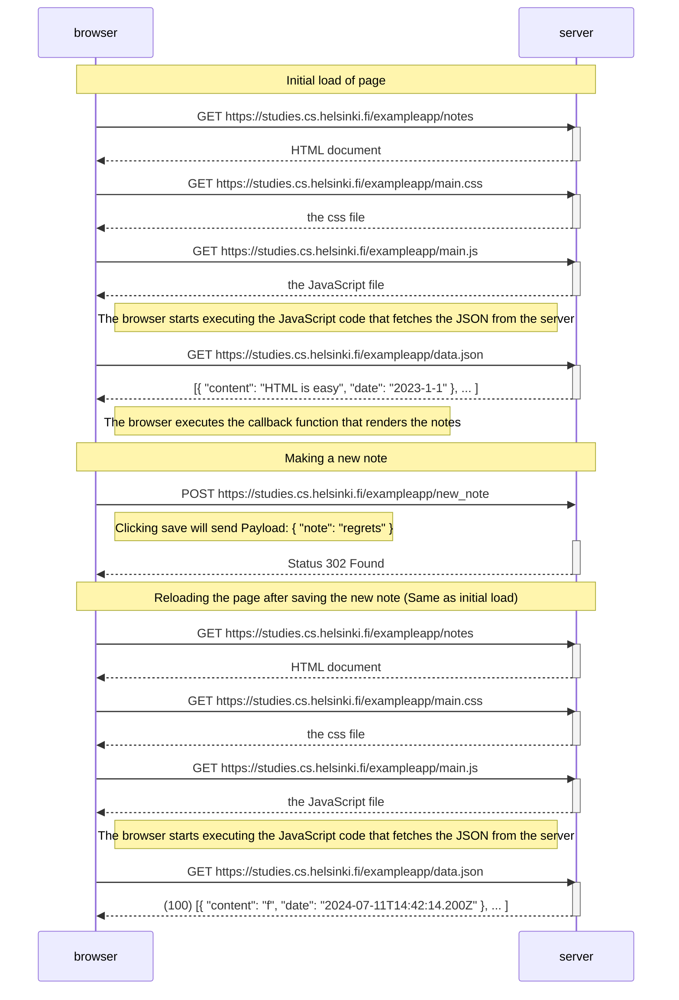

# Making a note on static page

```mermaid
sequenceDiagram
    participant browser
    participant server

    Note over browser,server: Initial load of page
    
    browser->>server: GET https://studies.cs.helsinki.fi/exampleapp/notes
    activate server
    server-->>browser: HTML document
    deactivate server
    
    browser->>server: GET https://studies.cs.helsinki.fi/exampleapp/main.css
    activate server
    server-->>browser: the css file
    deactivate server
    
    browser->>server: GET https://studies.cs.helsinki.fi/exampleapp/main.js
    activate server
    server-->>browser: the JavaScript file
    deactivate server
    
    Note right of browser: The browser starts executing the JavaScript code that fetches the JSON from the server
    
    browser->>server: GET https://studies.cs.helsinki.fi/exampleapp/data.json
    activate server
    server-->>browser: [{ "content": "HTML is easy", "date": "2023-1-1" }, ... ]
    deactivate server    

    Note right of browser: The browser executes the callback function that renders the notes 

    Note over browser,server: Making a new note

    browser->>server: POST https://studies.cs.helsinki.fi/exampleapp/new_note  
    Note right of browser: Clicking save will send Payload: { "note": "regrets" }
    activate server
    server-->>browser: Status 302 Found
    deactivate server

        Note over browser,server: Reloading the page after saving the new note (Same as initial load)
    
    browser->>server: GET https://studies.cs.helsinki.fi/exampleapp/notes
    activate server
    server-->>browser: HTML document
    deactivate server
    
    browser->>server: GET https://studies.cs.helsinki.fi/exampleapp/main.css
    activate server
    server-->>browser: the css file
    deactivate server
    
    browser->>server: GET https://studies.cs.helsinki.fi/exampleapp/main.js
    activate server
    server-->>browser: the JavaScript file
    deactivate server
    
    Note right of browser: The browser starts executing the JavaScript code that fetches the JSON from the server
    
    browser->>server: GET https://studies.cs.helsinki.fi/exampleapp/data.json
    activate server
    server-->>browser: (100) [{ "content": "f", "date": "2024-07-11T14:42:14.200Z" }, ... ]
    deactivate server    
    
```
