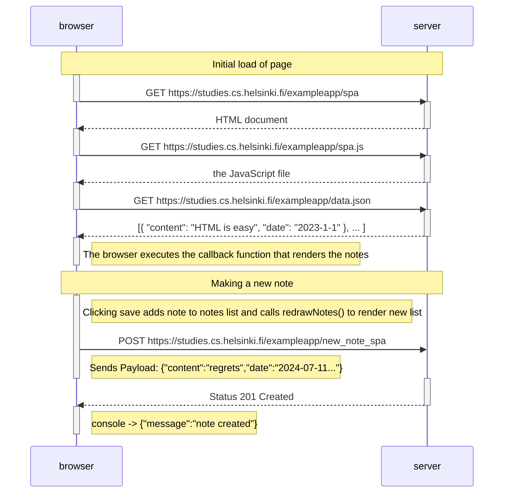

# Making a note in single page app

```mermaid
sequenceDiagram
    participant browser
    participant server

    Note over browser,server: Initial load of page
    
    activate browser
    browser->>server: GET https://studies.cs.helsinki.fi/exampleapp/spa
    deactivate browser
    
    activate server
    server-->>browser: HTML document
    deactivate server
    
    activate browser
    browser->>server: GET https://studies.cs.helsinki.fi/exampleapp/spa.js
    deactivate browser

    activate server
    server-->>browser: the JavaScript file
    deactivate server
    
    activate browser
    browser->>server: GET https://studies.cs.helsinki.fi/exampleapp/data.json
    deactivate browser

    activate server
    server-->>browser: [{ "content": "HTML is easy", "date": "2023-1-1" }, ... ]
    deactivate server

    activate browser
    Note right of browser: The browser executes the callback function that renders the notes
    deactivate browser

    Note over browser,server: Making a new note

    activate browser
    Note right of browser: Clicking save adds note to notes list and calls redrawNotes() to render new list

    browser->>server: POST https://studies.cs.helsinki.fi/exampleapp/new_note_spa
    Note right of browser: Sends Payload: {"content":"regrets","date":"2024-07-11..."}
    deactivate browser

    activate server
    server-->>browser: Status 201 Created
    deactivate server
    
    activate browser
    Note right of browser: console -> {"message":"note created"}
    deactivate browser
    
```
